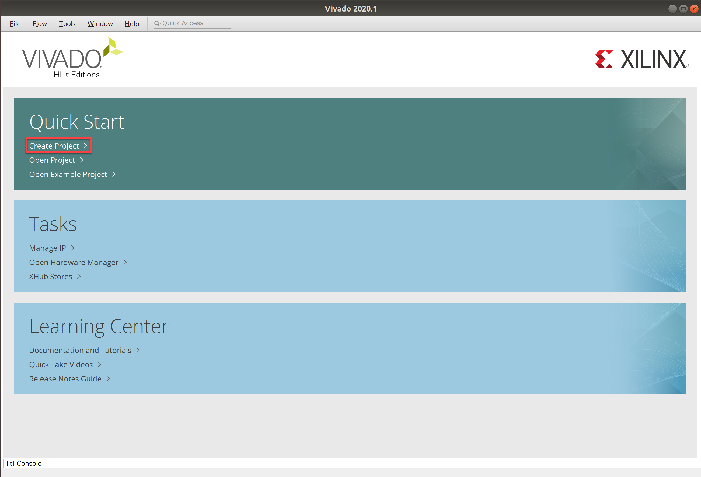
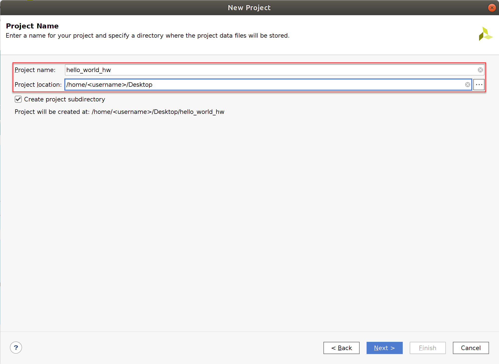
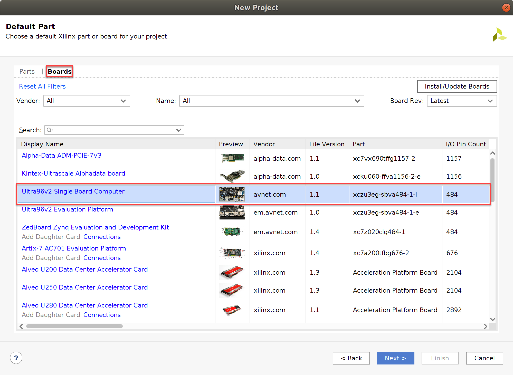
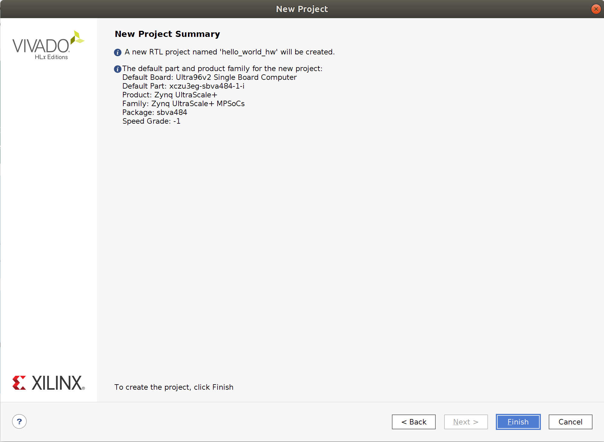
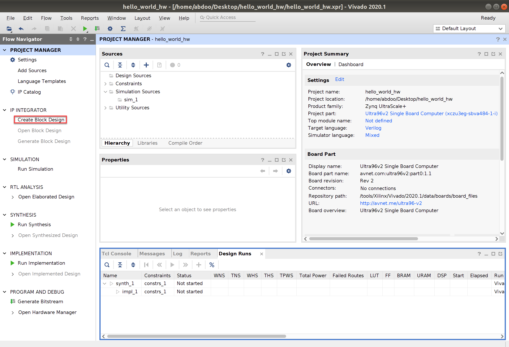

# Hello World Hardware Design in Vivado
## Pre-requisites
- Setting up VM Environment
- Installing Vitis & Vivado on the VM Environment
- Installing the Ultra96v2 bdf Files

## Steps
1. Right click on your Ubuntu VM Desktop and open up a terminal.
2. Run the following commands to load the Vivado environment and IDE:
```bash
source /tools/Xilinx/Vivado/2020.1/settings64.sh
vivado
```
3. Once the Vivado IDE loads up, click on `Create Project` under `Quick Start` section.

4. A project wizard will show up to guide you through selecting design sources and a target device. Hit `Next`.
5. Name your project "hello_world_hw" and save it under your Desktop folder. Replace `<username>` with your user name. Hit `Next`.

6. The next window specifies the project type. We're starting from scratch, so leave `RTL Project` selected and hit `Next`.
7. On the next window, we will select the Ultra96v2 development board as our target device. Switch to the `Boards` tab and select `Ultra96v2 Single Board Computer`. If you don't see the board, please go back to [Installing the Ultra96v2 bdf Files]() tutorial and ensure that they were installed correctly. Hit `Next`.

8. The next window shows a summary of our project. It should look like the window below. Hit `Finish`.

9. Click on `Create Block Design` in the `Flow Navigator` tab to the left.

10. A design wizard will appear on your screen. Set the design name to `hello_world_hw` and hit `OK`.

11. On the diagram window to the right, press on `+` to add a new IP block to your design.

12. A small window will show up with available IP blocks that you can add to your design. Search for `Zynq UltraScale+ MPSoC` or scroll to the bottom to find it. Double click on the IP block to add it to your design.

13. A block named `zynq_ultra_ps_e_0` will appear on your design. Notice that a green highlight appears at the top of the `Diagram` window saying "Designer Assistance available". Click on `Run Block Automation` prompt.

14. The window below will appear on your screen. The Apply Board Preset checkbox applies the Preset TCL that was included as part of the board definition archive. This step is important for connecting the IO ports of (USB, UART, DP, etc.) to the Zynq IP block. Leave this checked. Hit `OK`.

15. Notice how the inputs and outputs of the Zynq IP block change. The `maxihpm` clocks must be connected. You can do this by clicking and dragging from the `pl_clk0` pin to each `maxihpmx_fpd_aclk` pin.

