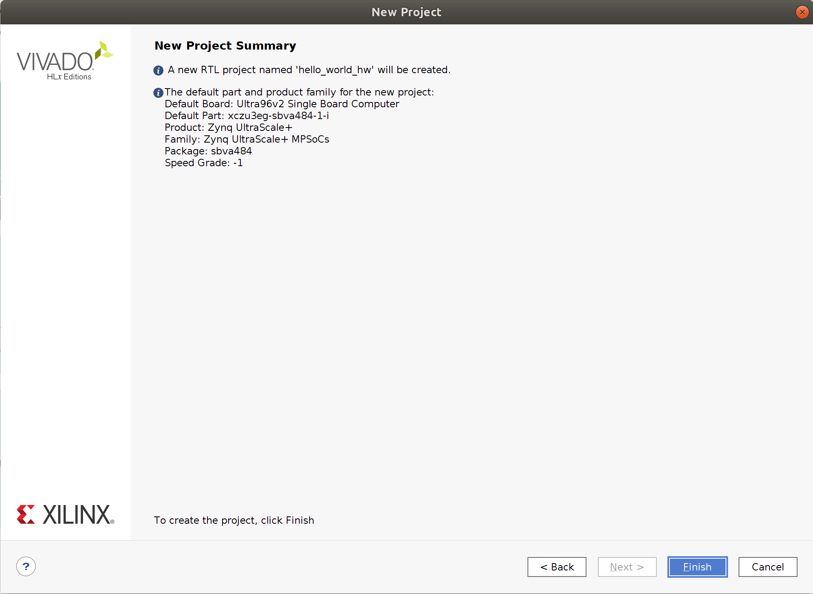
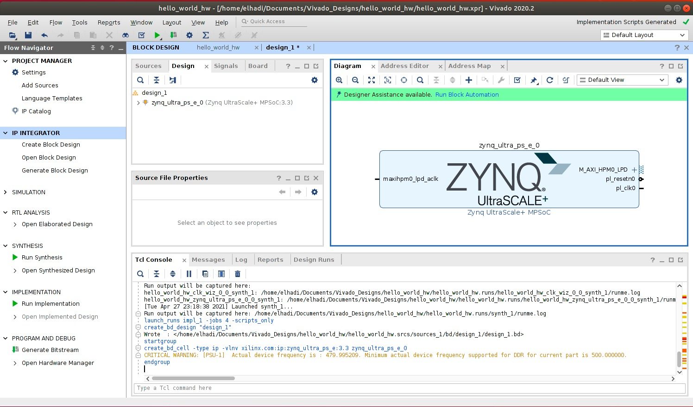
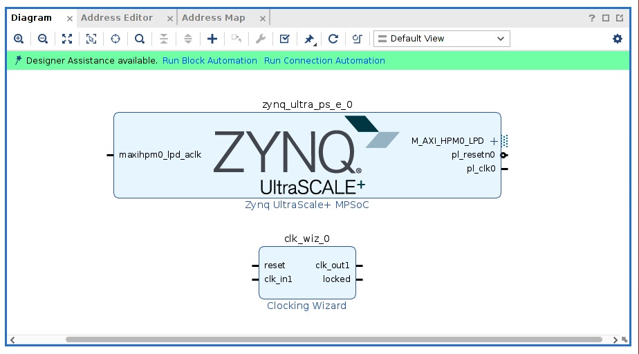
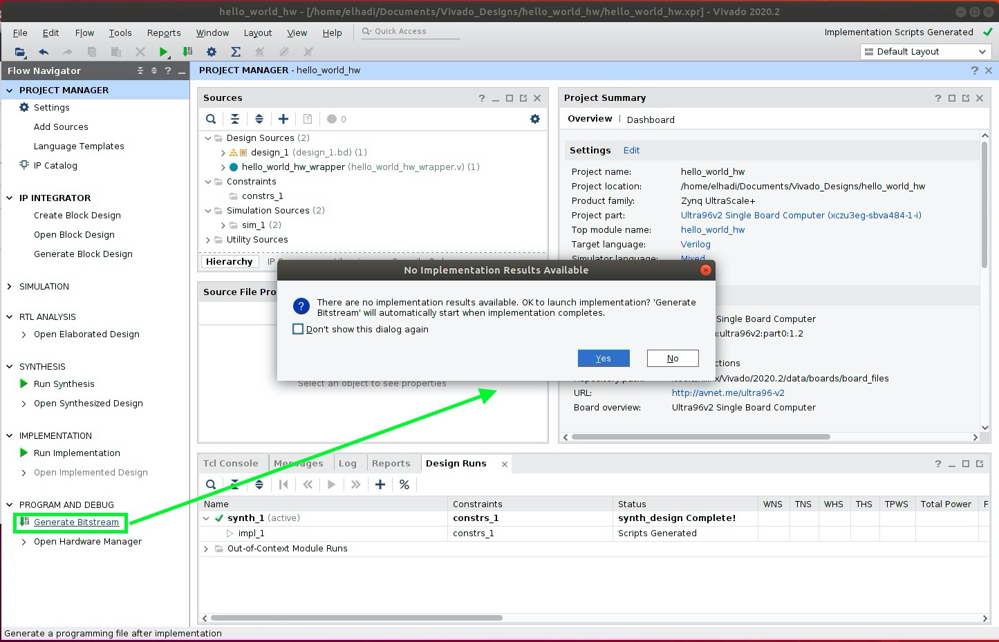

# Hello World Hardware Design in Vivado
## Description

## Pre-requisites
- [Setting up VM Environment](../virtual_machine_setup/tutorial.md)
- Installing Vitis & Vivado on the VM Environment
- Installing the Ultra96v2 bdf Files

## Steps
1. Right click on your Ubuntu VM Desktop and open up a terminal.
2. Run the following commands to load the Vivado environment and IDE:
```bash
source /tools/Xilinx/Vivado/2020.1/settings64.sh
vivado
```
3. Once the Vivado IDE loads up, click on `Create Project` under `Quick Start` section.

4. A project wizard will show up to guide you through selecting design sources and a target device. Hit `Next`.
5. Name your project "hello_world_hw" and save it under your Desktop folder. Replace `<username>` with your user name. Hit `Next`.

6. The next window specifies the project type. We're starting from scratch, so leave `RTL Project` selected and hit `Next`.
7. On the next window, we will select the Ultra96v2 development board as our target device. Switch to the `Boards` tab and select `Ultra96v2 Single Board Computer`. If you don't see the board, please go back to [Installing Vitis & Vivado on the VM Environment]() tutorial and ensure that you installed the Ultra96v2 bdf files correctly. Hit `Next`.

8. The next window shows a summary of our project. It should look like the window below. Hit `Finish`.

9. Click on `Create Block Design` in the `Flow Navigator` tab to the left.

10. A design wizard will appear on your screen. Set the design name to `hello_world_hw` and hit `OK`.

11. On the diagram window to the right, press on `+` to add a new IP block to your design. In the search bar type `zynq` then click on the `Zynq UltraScale+ MPSoC` as shown below

12. The Zynq IP will look like the image below.

13. Let's add a `Clocking Wizard` IP to generate a clock for the Zynq IP. Just like we looked up the Zynq IP, let's look up `Clocking Wizard` in the search bar then hit enter. The design should now consist of 2 IP blocks - `Zynq UltraScale+ MPSoC` and `Clocking Wizard`, as shown below.

14. Now let's wire some pins. To wire, simply hover over a pin and then click and drag. Make the following connections:
    - Connect `pl_clk0` of the `Zynq UltraScale+ MPSoC` to `clk_in1` of the `Clocking Wizard`.
    - Connect `clk_out1` of the `Clocking Wizard` to `maxihpm0_lpd_aclk` of the `Zynq UltraScale+ MPSoC`.
    - The complete design should look like the figure below.
 
15. Now that our design is complete, let's synthesize it. First, we need to to set a top-level entity via an HDL wrapper like shown below. Right click on the design name, `hello_world_hw`, to bring up the shown menu.

16. Let's synthesize this thing. Simply press on `Run Synthesis` under the `Synthesis` dropdown on the left sidebar. Then click `OK` that comes up. The synthesis progress will be shown on the top right of the window.


17. When synthesis is done, a new GUI pops up asking you to `Run Implementation`. Hit `OK`.

18. Let's generate the bitstream. Click on `Generate Bitstream` under `PROGRAM AND DEBUG` on the left sidebar.

19. All we have to do now is export this hardware design so we can upload software applications on it in the Vitis or PetaLinux software tools. 
    Click on `File` -> `Export` -> `Export Hardware`.

20. Click `Next`.
21. For the `Output` window, select `Include bitstream`. The software tools will need the bitstream to access the hardware.

22. Specify where you would like to save the XSA file. The XSA contains all information about the hardware design.

23. Click `Next`. A summary page will show up, then click `Finish`.

### That's it! We have just built a simple hardware design from scratch using the Xilinx Vivado Design Tool. Reference the [software version of hello world](../hello_world_sw/tutorial.md) to upload a simple hello world software application on it using the Utlra96 FPGA as your actual hardware.
