# How to run hello world application on a hardware design
#### In this tutorial we will be running a hello world application on a hardware design platform using the Xilinx Vitis IDE. Essentially, we are uploading this hello world application on the FPGA. Make sure you have satisfied all requirements under the Prerequisites section.

## Prerequisites
- Xilinx Vitis IDE - [install vivado & vitis](../install_vitis_and_vivado/install_vitis_and_vivado.md)
- A hardware .xsa file - [hello world tutorial](../hello_world_hw/hello_world_hw.m)
- Ultra96v2 board

## Creating the hardware design platform

* Open vitis and click on *Create Platform Project*
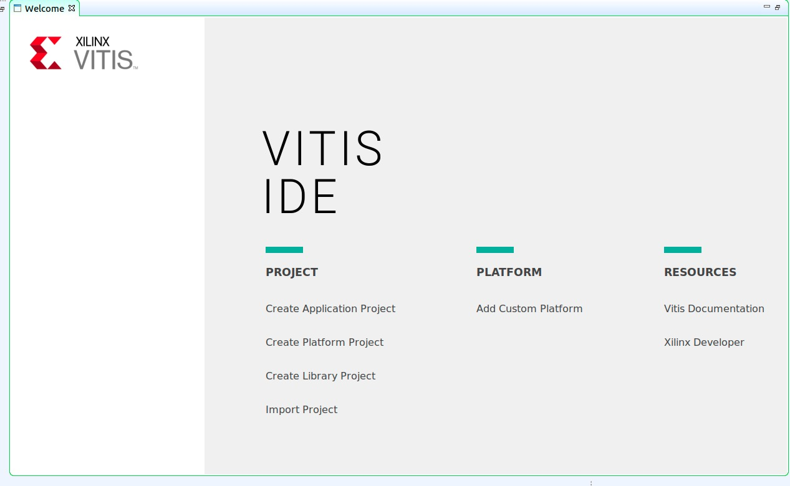

* Enter a platform project name then click *Next*
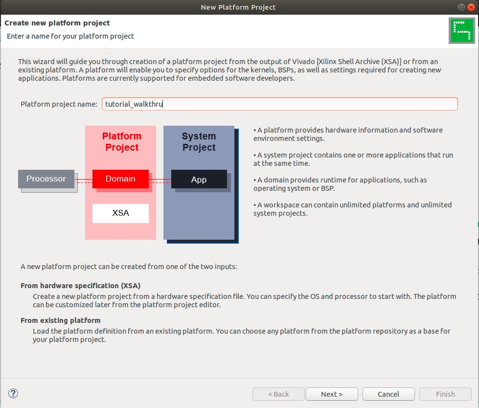

* Click *Browse...* and go find the **.xsa** file you exported in [hello world tutorial](../hello_world_hw/hello_world_hw.m)
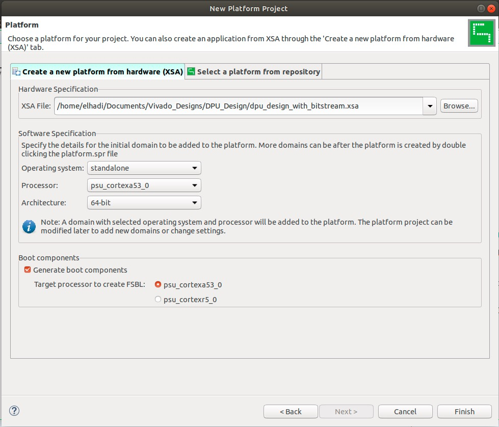

* Click *Finish*

## Creating the hello world application
#### Now that we have created the platform, let's create a new hello world application for it to run on top of it.

* Click *File* -> *Application Project...*
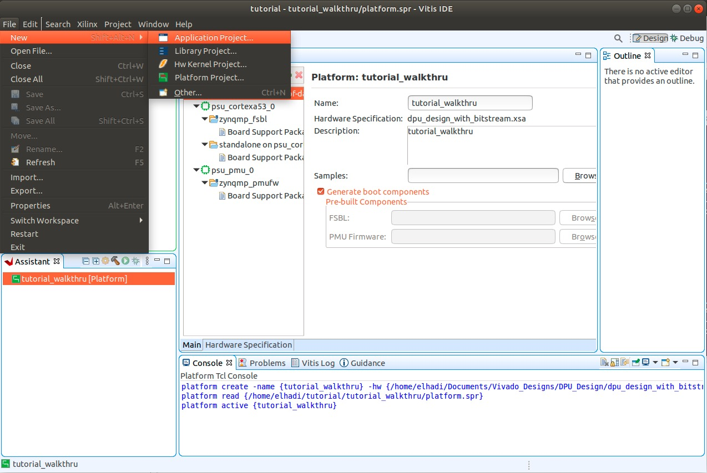

* Click *Next*
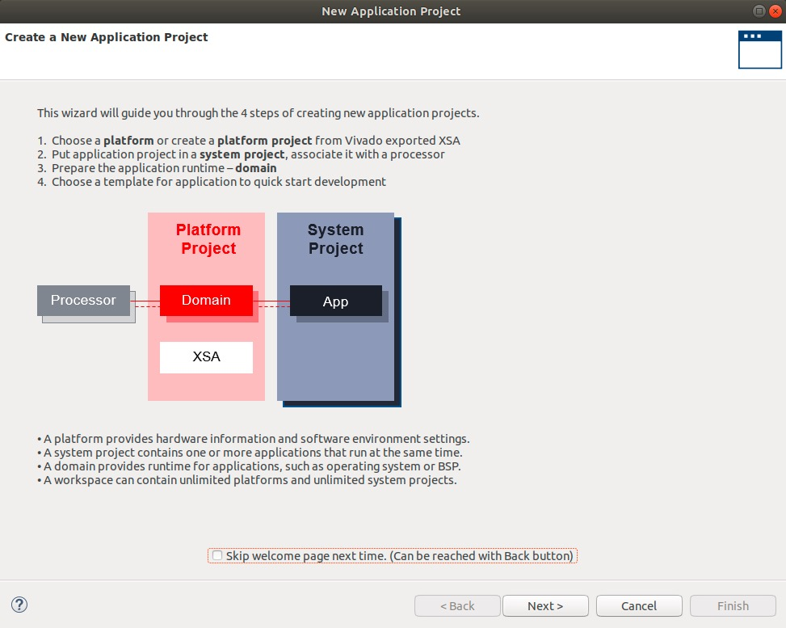

* Select the platfrom we have already created above then click *Next*
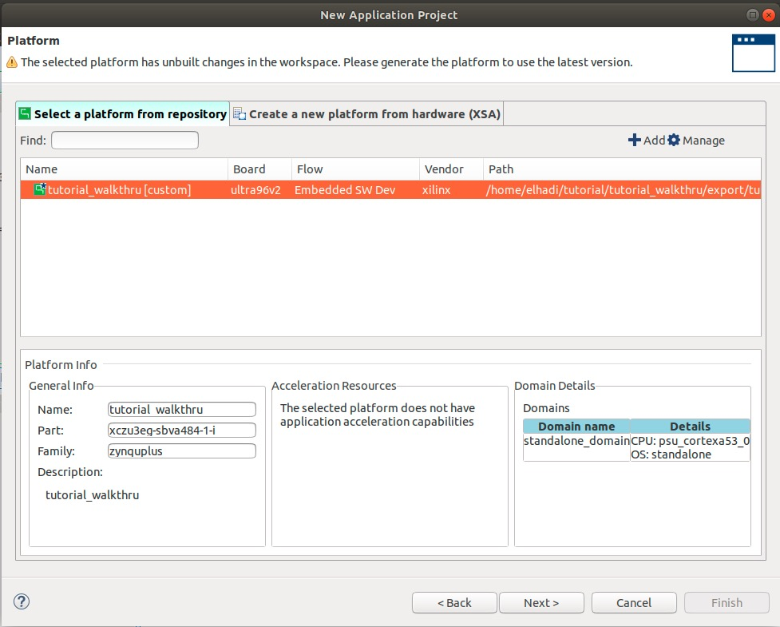

* Enter a name for the application then click *Next*
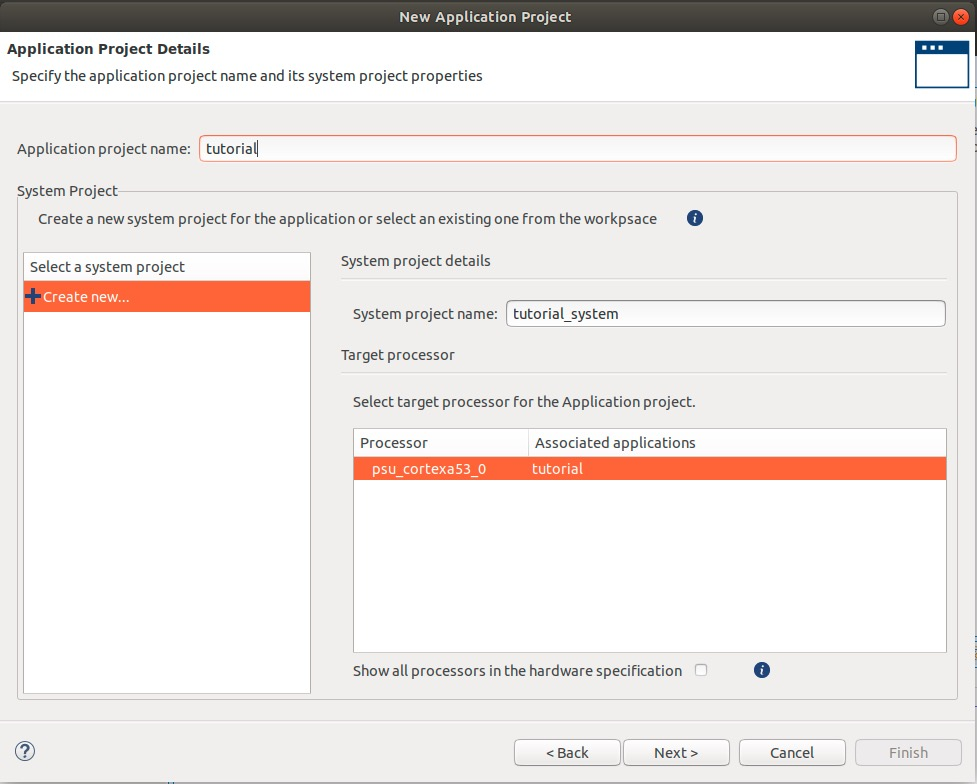

* The *Domain* page should be the same as the screen shot below then click *Next*
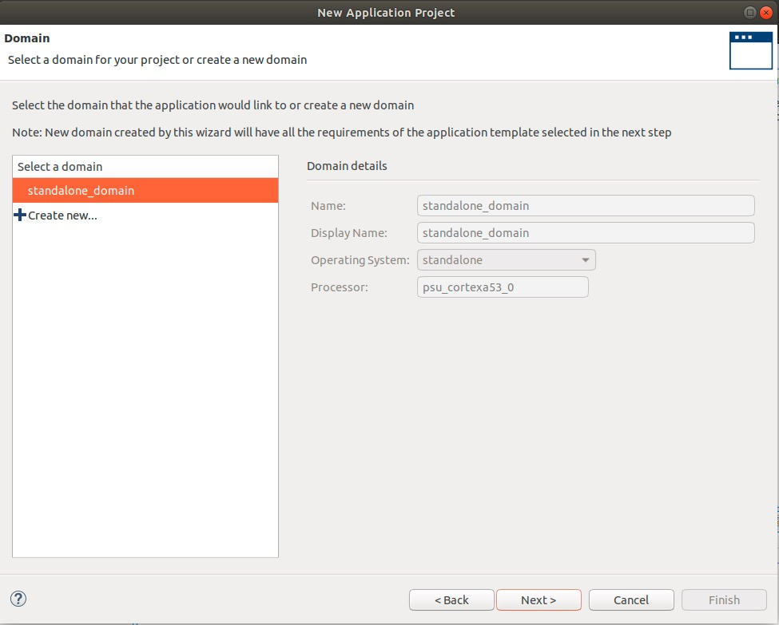

* Select the *Hello World* as the development template then click *Finish*
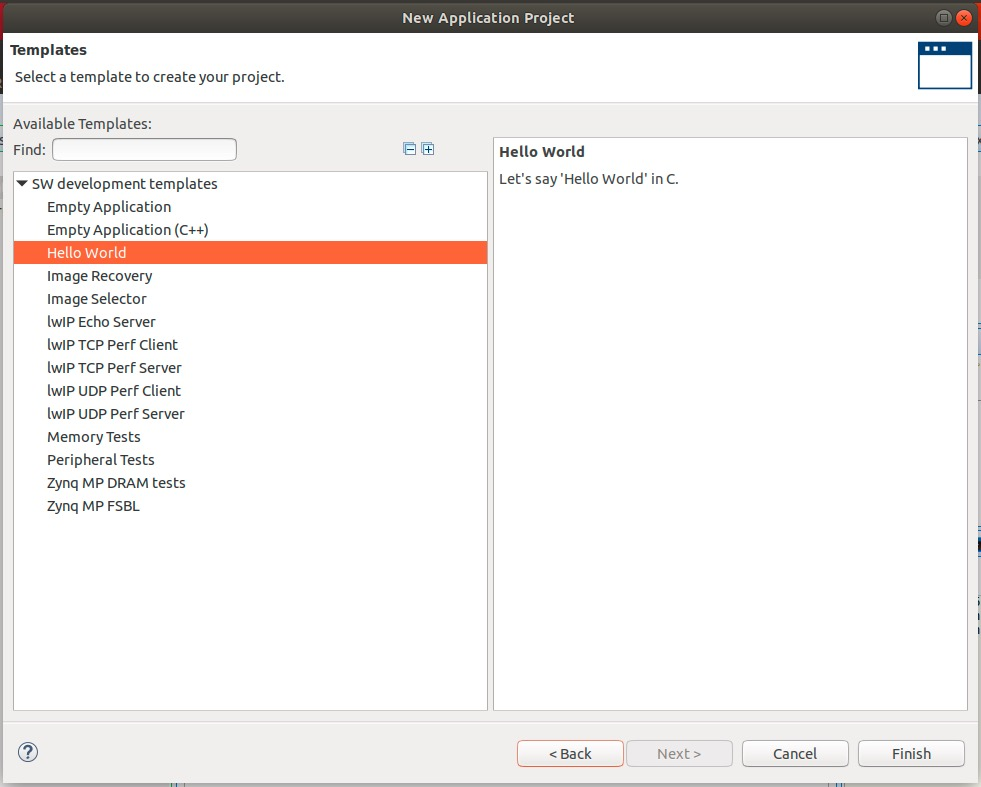

## Uploading the hello world program

* First let's build the project and assure there is no errors. Right click on the application then click *Build Project*
  *  Note - if you experience warnings, go to right click on application then click *Clean Project*
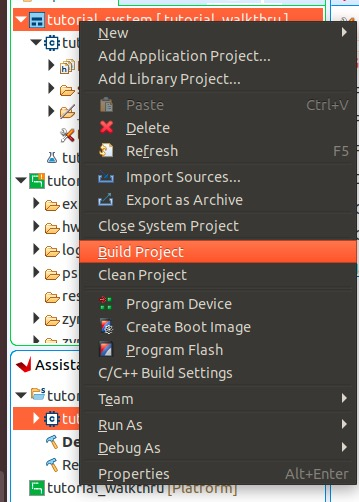

* By default the uart0 port is selected, we need to select uart1 as our serial port. Go to the platform file on the right middle window like below.
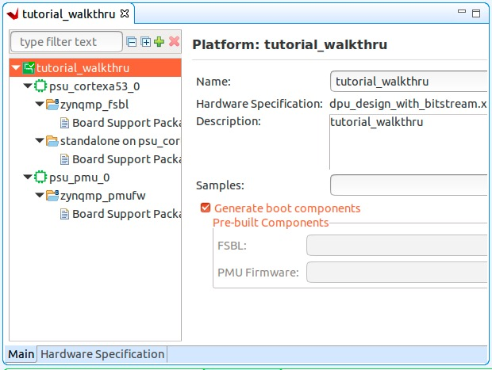

* Click on *Board Support Package* under *zynqmp_fsbl* which is under *psu_cortexa53_0*. Then click on *Modify BSP Settings...*
* Click on *standalone*. Change the *stdin* & *stdout* values to *psu_uart_1* then click *OK*
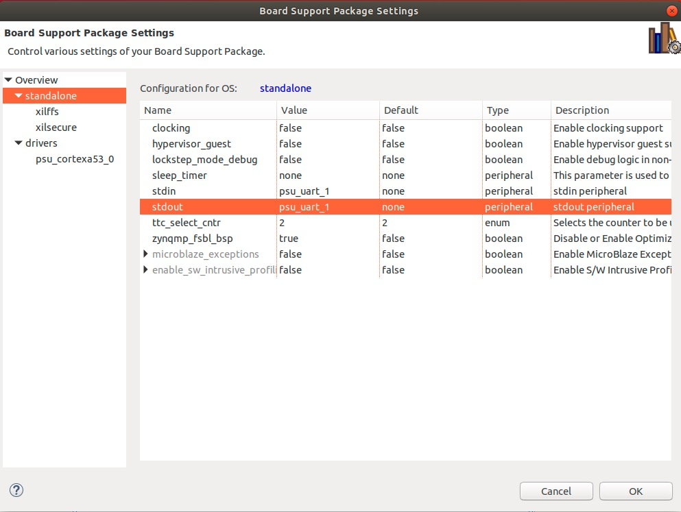

* Repeat the same step above for *Board Support Package* under *standalone on psu_cortexa53_0*

* Now let's open a serial monitor to see the printed contents of the *helloworld.c* file.

* Open the terminal and type **sudo minicom -s**. You will need to type in your password

**Make sure the ultra96v2 FPGA board is connected to the power supply and the usb cable is connected from your computer to the USB-to-JTAG/UART pod**

* In Vitis IDE, right click on the application then *Debug As* -> *Launch Hardware*
  * This will upload the program on the FPGA board
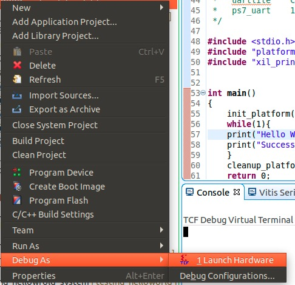

* The debugger will pop up now. Go ahead and click on the *step over* button until you step over the *print("Hello World\n\r");* line
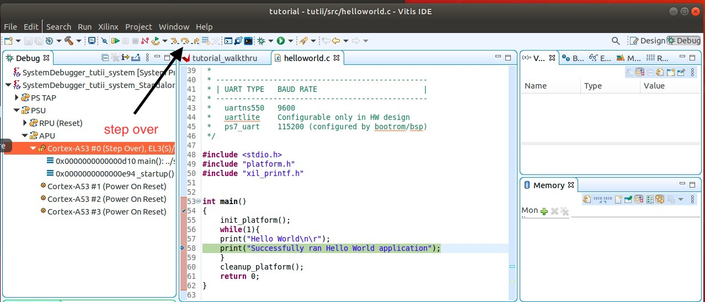 

* Let's go back to the terminal. You should see the hello world text printed on the minicom in the serial port1 we configured above.
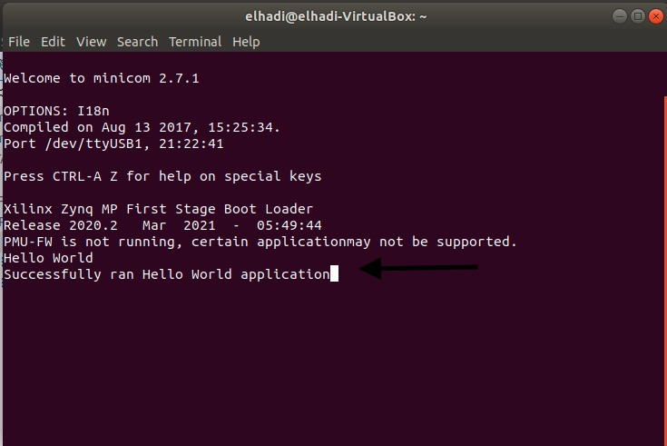

