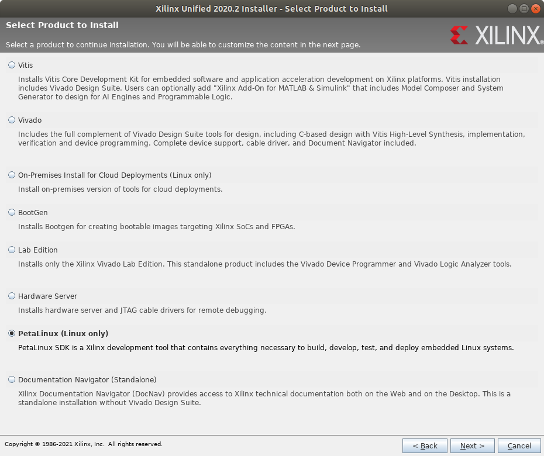
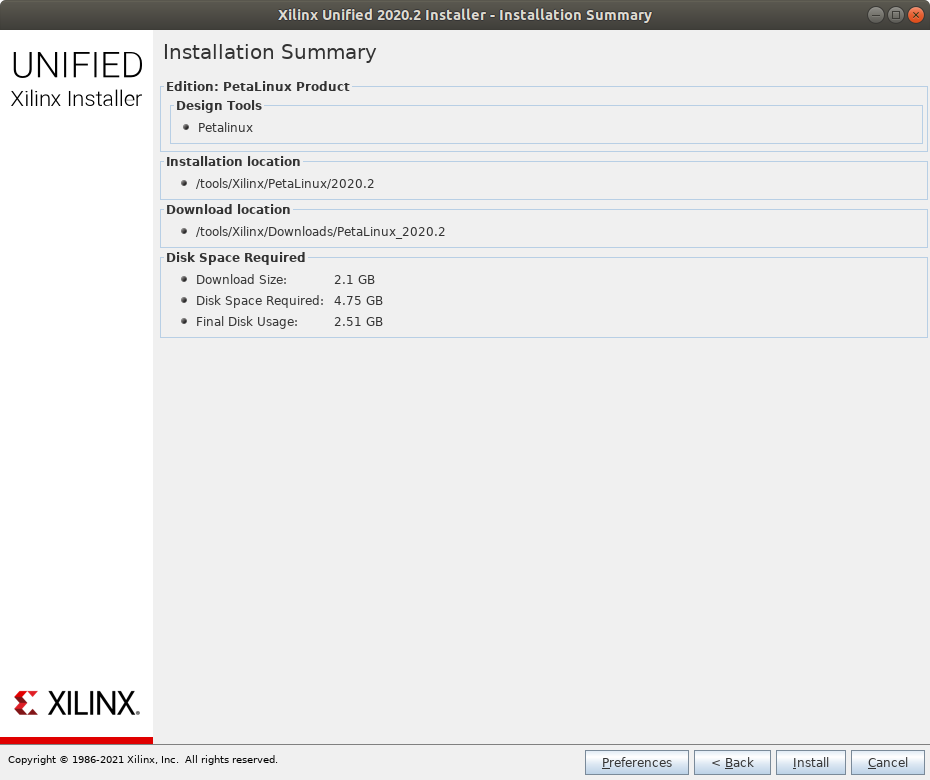
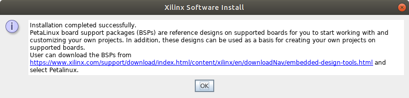

# Install Petalinux Tools
## Description
This tutorial lists the steps to install the Petalinux tools in your Ubuntu VM. You will need to use those tools to configure the Petalinux OS kernel and hardware designs.

## Pre-requisites
- [Setting up VM Environment](../virtual_machine_setup/tutorial.md)
- [Install Vitis and Vivado IDEs](../install_vitis_and_vivado/install_vitis_and_vivado.md)

## Steps
0. The following packages are required to install Petalinux tools:
    ```bash
    sudo apt update
    sudo apt install -y python gawk gcc git make net-tools libncurses5-dev tftpd zlib1g:i386 libssl-dev flex bison libselinux1 gnupg wget diffstat chrpath socat xterm autoconf libtool tar unzip texinfo zlib1g-dev gcc-multilib build-essential libsdl1.2-dev libglib2.0-dev screen pax gzip
    ```
1. Go to your Xilinx Unified Installer directory and run the installer:
    ```bash
    cd ~/Downloads/Xilinx_Unified_2020.2_1118_1232
    ./xsetup
    ```
2. The welcome screen for Xilinx Unified 2020.2 Installer will pop up. Hit `Next`.
3. On the next screen. `Vitis` will be selected as the product to install. Change the selection to `Petalinux` and hit `Next`.

4. The next page shows the license agreements. Accept all of them and hit `Next`.
5. The next page shows some installation options. Keep the default options and hit `Next`.
6. The next page shows the Installation Summary. It should look like the one below. Hit `Install`.

7. A window will pop up to notify you when the installation is complete. Hit `OK` to close the window.


## Next Steps
Now that you have installed Petalinux tools, you can move on to the next tutorial to [build a Petalinux OS](../build_petalinux_os/build_petalinux_os.md) for the Ultra96v2 development board.
