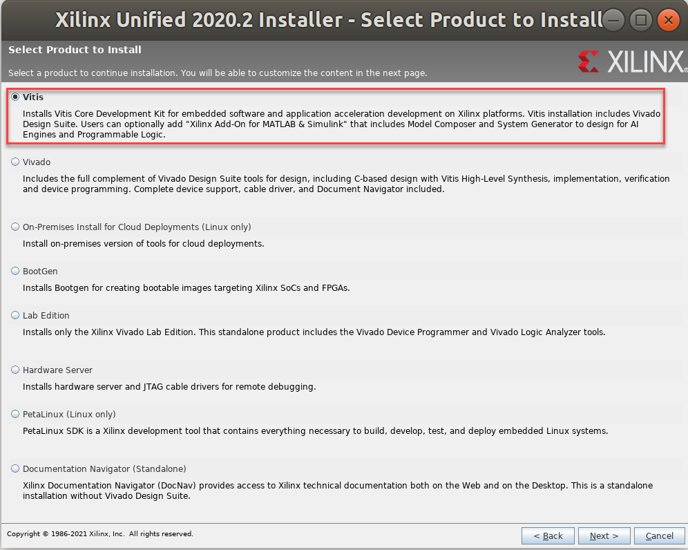
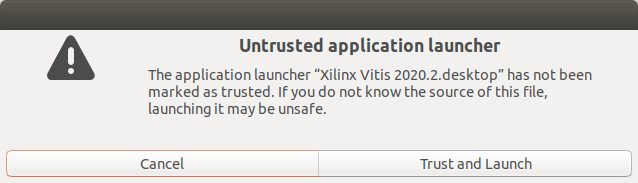

# Install Vitis and Vivado IDEs
## Description
This tutorial lists the steps to install the Vitis and Vivado IDEs in your Ubuntu VM. The installation requires a lot of space, so make to sure to follow the pre-requisite tutorials and satisfy the requirements. Depending on your internet speed and VM specs, the steps in this tutorial may take more than 3 hours.

## Pre-requisites
- [Setting up VM Environment](../virtual_machine_setup/tutorial.md)

## Requirements
- 50+ GB of available internet usage allowance
- 200+ GB of free storage in the VM.

## Steps
1. Go to [Xilinx Downloads](https://www.xilinx.com/support/download/index.html/content/xilinx/en/downloadNav/vitis.html) website and click on `Xilinx Vitis 2020.2: All OS installer Single-File Download` link.

2. A sign in window will show up. If you do not have an account with Xilinx, click on `Sign up`. Otherwise, sign in with your credentials and click on `Download`.
3. When the download is done, right click on your desktop and click on `Open Terminal`. Run the following commands to extract the compressed file:
    ```bash
    cd ~/Downloads
    tar -xf Xilinx_Unified_2020.2_1118_1232.tar.gz
    ```
4. After extracting the file, run the following commands to start the installer:
    ```bash
    cd Xilinx_Unified_2020.2_1118_1232
    sudo mkdir -p /tools/Xilinx
    sudo chown $USER /tools/Xilinx
    ./xsetup
    ```
5. The welcome screen for Xilinx Unified 2020.2 Installer will pop up. Hit `Next`.
6. On the next screen. `Vitis` will be selected as the product to install. Leave `Vitis` and hit `Next`.

7. The next page will allow you to customize your installation. Leave the default selections and hit `Next`.
8. The next page shows the license agreements. Accept all of them and hit `Next`.
9. The next page shows the destination directory and the required disk space. If you had 200+ GB of free storage at the beginning of this tutorial, then you should have enough space left to go to the next step. Otherwise, try deleting `Xilinx_Unified_2020.2_1118_1232.tar.sz` to get ~45 GB back. Hit `Next`.
10. The next page shows the Installation Summary. It should look like the one below. Hit `Install`.

11. A window will pop up to notify you when the installation is complete. Hit `OK` to close the window.
12. Xilinx Information Center will pop-up asking you to install updates. Ignore the updates for now and close the window.
13. Run the following commands to install a number of necessary packages for the Vitis tools:
    ```bash
    cd /tools/Xilinx/Vitis/2020.2/scripts
    sudo ./installLibs.sh
    sudo apt install -y make
    ```
14. You should now see several icons like the one below on your Desktop that were added by the installer:  
  
Double clicking those icons will show the a promt like the one below:

Hit `Trust and Launch` to trust and launch the Xilinx IDEs.
15. Now that Vitis and Vivado are installed, the only step left is to add the bdf files for the Ultra96v2. Those files contains necessary information for Vivado to target the Ultra96v2 board for hardware designs. Open up a terminal and run the following commands:
    ```bash
    sudo apt install -y git
    mkdir -p ~/project/2020.2
    cd ~/project/2020.2
    git clone https://github.com/Avnet/bdf
    cp -r ~/project/2020.2/bdf/ultra96v2 /tools/Xilinx/Vivado/2020.2/data/boards/board_files
    cd /tools/Xilinx/Vitis/2020.2/data/xicom/cable_drivers/lin64/install_script/install_drivers
    sudo ./install_drivers
    ```

## Next Steps
Now that you have installed Vitis and Vivado IDEs, you can move on to the next tutorial and create a simple [Hello World Hardware Design in Vivado](../hello_world_hw/hello_world_hw.md).
